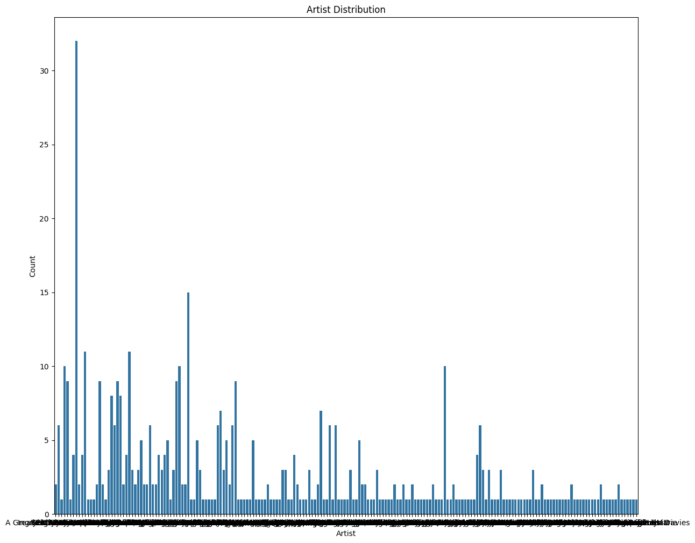
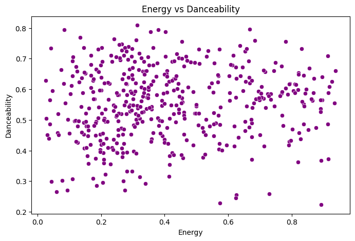
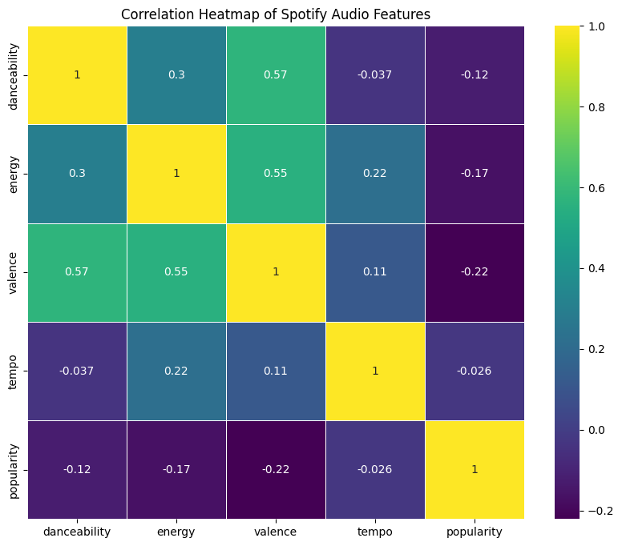
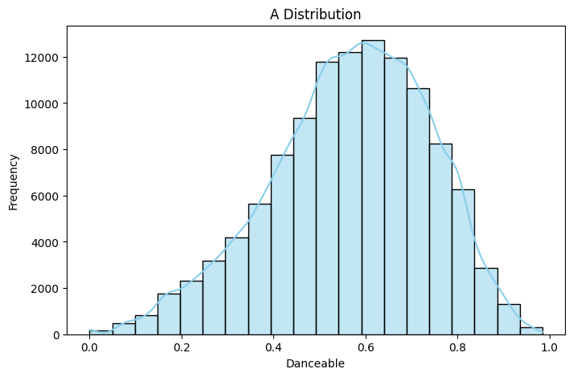
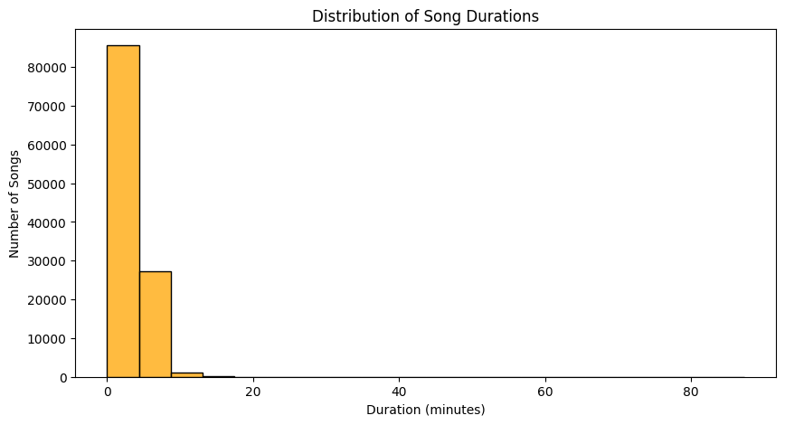
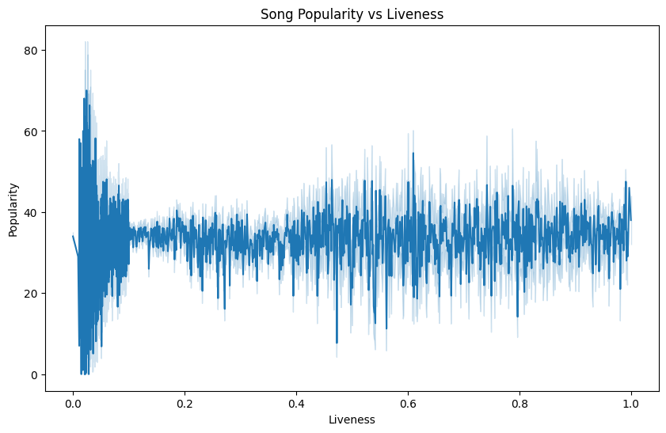
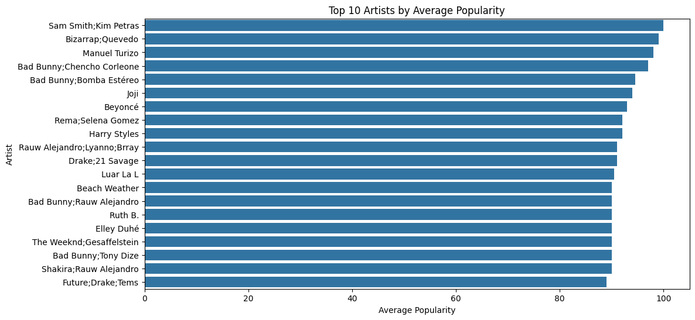

# Spotify Dataset Visualization & Insights

## 📊 Dataset Overview

This project analyzes a **Spotify dataset** with over **114,000 tracks** across 21 columns.  
It includes:

- **Metadata**: `track_id`, `artists`, `album_name`, `track_name`, `track_genre`
- **Popularity Metrics**: `popularity`, `explicit`
- **Audio Features**: `danceability`, `energy`, `valence`, `tempo`, `speechiness`, `acousticness`, etc.

The goal is to explore **music patterns**, **artist performance**, and **factors that influence popularity**.

---

## 📈 Visualizations

### 1. Artist Distribution

Shows the distribution of songs across different artists.  

**Insight:** Many artists have only a few tracks, while a small group contributes a large number of songs.

---

### 2. Correlation Heatmap of Audio Features

Displays correlations between features like danceability, energy, valence, tempo, and popularity.  

**Insight:** Danceability and energy show stronger influence on popularity compared to tempo.

---

### 3. Danceability Distribution

Histogram showing how danceability is spread across the dataset.  

**Insight:** Most tracks fall in the mid-to-high range, suggesting upbeat music is more common.

---

### 4. Song Popularity vs Liveness

Scatter plot of liveness against popularity to analyze trends.  

**Insight:** Extremely high liveness (live-performance feel) usually corresponds to lower popularity.

---

### 5. Additional Distribution Example

Example of another audio feature visualization.  

---

### 6. Popularity vs Other Features

Shows trends of popularity against other attributes like energy or tempo.  

---

### 7. Final Visualization

Additional visualization summarizing dataset insights.  

---

## 🔍 Key Insights

- **Popularity** is influenced more by **danceability** and **energy** than by tempo.
- **Highly live tracks** are less popular, showing that studio versions dominate.
- **Top artists** significantly outperform average ones, highlighting industry imbalance.
- The dataset is **skewed**, with many one-hit artists and a few consistent chart-toppers.

---

## 🚀 Future Work

- Use **machine learning regression** to predict popularity.
- Study **genre-specific trends** in audio features.
- Perform **time-series analysis** to see how music styles evolve over years.

---

## 📂 How to Run

1. Open `Task3.ipynb` in Jupyter Notebook.
2. Run all cells to generate visualizations.
3. Save the plots into the `screenshots/` folder.
4. View insights in this README.

---
